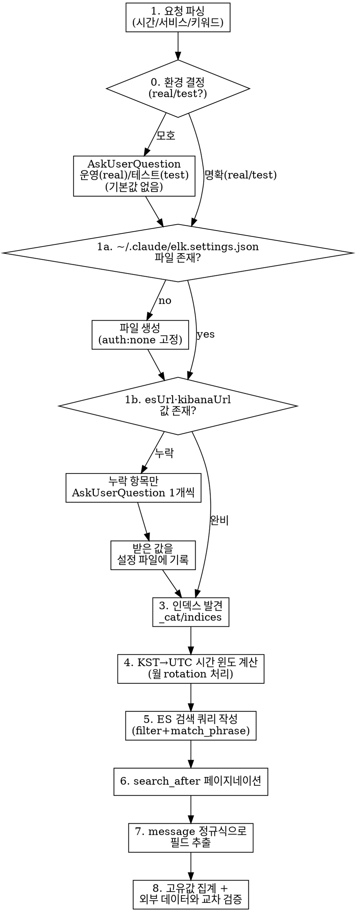

# Fetch ELK

## Overview

ELK 클러스터의 Elasticsearch HTTP API를 curl/python으로 직접 호출하여 **로그 검색·에러 패턴 추출**을 수행하는 skill. Kibana 웹 UI를 거치지 않고 ES에 직접 쿼리하므로 임의 조건/대량 추출이 가능하다.

접속 대상 ES 엔드포인트(`esUrl`)·Kibana URL 은 **코드에 박지 않고** 글로벌 설정 파일 `~/.claude/elk.settings.json` 에서 읽는다. 이 파일은 사내 서버 주소를 담으므로 **플러그인 저장소(공개)에는 절대 커밋하지 않는다.** 인증은 `none` 고정이므로 자격증명은 저장하지 않는다.

## 접속 대상 (절대 규칙)

- 이 스킬은 `~/.claude/elk.settings.json` 에 **등록된 ES 엔드포인트에만** 연동한다.
- 설정에 없는 ES/Elasticsearch URL을 사용자가 요청하면, 먼저 설정 파일에 등록하도록 안내한 뒤 사용한다.
- **환경(real/test) 먼저 결정 후 해당 env에만 접속. 모호하면 추측하지 말고 Step 0에서 되묻기.**
- **읽기 전용**: `_search`, `_count`, `_cat/*`, `_mapping`, `_msearch` 외의 호출(PUT/DELETE/POST 인덱스 작업)은 절대 금지.

## When to Use

- "ELK", "엘크", "Kibana", "키바나", "elasticsearch" 키워드 등장 시
- "로그 조회", "에러 로그 찾아", "로그에서 ~검색", "로그 분석", "영향 범위", "어떤 사용자가 ~ 했어" 요청 시
- 사용자가 `elk.*` / `kibana.*` URL을 공유한 경우
- 메일/Slack 알림 외의 **전수(원본) 로그**가 필요한 분석
- 환경 신호(운영/테스트 키워드·URL)가 있으면 해당 env 선택. 없으면 Step 0에서 1회 되묻기.

## 조회 흐름



## Step 0: 환경 결정 (real/test)

접속 전에 **반드시** 대상 환경을 확정한다. 모호하면 운영 기본선택 안 함 — `default` 키는 자동선택 근거가 아님.

### 키워드 매핑 (대소문자 무시, 부분문자열, URL 우선)

| 신호 | 판정 |
|---|---|
| "운영", "운영ELK", "real", "prod", "프로덕션", "라이브" 또는 운영 elk.* URL | `real` |
| "테스트", "스테이징", "staging", "test" 또는 test-elk.* / staging-elk.* URL | `test` |
| 신호 없음("elk 조사해", "로그 조회", "에러 로그 찾아") 또는 신호 상충 | 모호 → 되묻기 |

### 모호 시 되묻기

모호할 때만 `AskUserQuestion` **1회**, 2지선다:

> 어느 환경의 ELK를 조회할까요?
> 1. 운영(real)
> 2. 테스트(test)

**기본값 없음** — 운영 오접속 방지. 사용자 선택 후 해당 `ENV_NAME`("real" 또는 "test")으로 확정하고 Step 1로 진행. 명확한 경우 이 질문을 건너뜀.

## Step 1: 접속 설정 로드 (`~/.claude/elk.settings.json`)

Step 0에서 확정된 `ENV_NAME`("real" 또는 "test")을 기준으로 설정을 로드한다. 순서는 **(1a) 파일 존재 확인 → (1b) 선택 env의 필수 필드(`esUrl`·`kibanaUrl`) 값 확인**이며, 누락된 것만 실행자에게 하나씩 물어본다. 보안 민감 정보이므로 저장소가 아니라 글로벌 `~/.claude/` 아래에만 둔다.

### 1a. 파일 존재 확인 → 없으면 생성

`~/.claude/elk.settings.json` 이 없으면 아래 골격으로 **새로 생성**한다. 실제 생성 시 `esUrl`·`kibanaUrl` 은 **빈 문자열(`""`)로 둔다**(아래 스키마의 `<...>` 는 구조 참조용 표기이며, real·test 두 env 모두 빈 문자열로 생성). 1b에서 채운다. `auth` 는 항상 `{"type": "none"}` 으로 **고정**한다(이 스킬은 무인증 ES 전용 — auth 는 절대 묻지 않는다).

### 1b. 필수 필드 확인 → 누락분만 1개씩 질문

**Step 0에서 선택된 env(`ENV_NAME`)에서** `esUrl`, `kibanaUrl` 값이 채워져 있는지 확인한다. **비어 있거나 없는 항목만** `AskUserQuestion` 으로 **한 번에 하나씩** 실행자에게 묻고, 받은 값을 설정 파일에 기록한 뒤 진행한다. 다른 env 값으로 fallback 금지.

- `esUrl` 누락 → "`{ENV_NAME}` ES 엔드포인트 URL?" 질문 (예: `http://<host>:9200`) — 필수
- `kibanaUrl` 누락 → "`{ENV_NAME}` Kibana URL?" 질문 (예: `https://<kibana-host>`) — CSV export / index UID 매핑 참조용

> - 두 값이 모두 채워져 있으면 **질문 없이** 바로 Step 2로 진행한다.
> - 한 번에 하나씩만 물어본다(esUrl 먼저, 그다음 kibanaUrl). 두 개를 한 질문에 묶지 않는다.
> - `auth` 는 묻지 않는다. 항상 `none` 고정.

### 파일 스키마

```json
{
  "default": "real",
  "environments": {
    "real": {
      "esUrl": "http://<ES_HOST>:9200",
      "kibanaUrl": "https://<KIBANA_HOST>",
      "auth": { "type": "none" }
    },
    "test": {
      "esUrl": "http://<TEST_ES_HOST>:9200",
      "kibanaUrl": "https://<TEST_KIBANA_HOST>",
      "auth": { "type": "none" }
    }
  }
}
```

> `auth` 는 `{"type": "none"}` 으로 **고정**이다 — 이 스킬은 무인증 ES 전용이며 인증 방식을 묻거나 바꾸지 않는다.

> `default` 는 참고용으로만 남긴다. 환경 결정은 Step 0이 담당하며, **모호 시 default 자동진행 금지**.

> ⚠️ 이 파일은 **글로벌 `~/.claude/` 에만** 저장한다. 플러그인 저장소는 공개이므로 ES 주소를 코드/문서에 절대 적지 않는다. 새 환경 추가 시 `environments` 에 키를 추가한다.

### 설정 로드 헬퍼 (이후 모든 Step에서 재사용)

```python
import json, os
PATH = os.path.expanduser("~/.claude/elk.settings.json")
CFG  = json.load(open(PATH))
ENV_NAME = "real"  # ← Step 0 결정값("real"|"test")으로 치환. default 자동사용 금지
ENV = CFG["environments"][ENV_NAME]
ES, KIBANA = ENV["esUrl"], ENV.get("kibanaUrl")
# auth 는 none 고정 — 인증 헤더/옵션 없음
```

`auth` 가 `none` 고정이므로 ES 호출 시 인증 헤더·옵션을 붙이지 않는다(`urllib`/curl 호출에 `-u`/`Authorization` 헤더 불필요). ES 호출은 `requests` 같은 외부 패키지 없이 `curl` + python3 표준 라이브러리(`urllib`)로만 수행한다.

## Step 2: 인덱스 발견

서비스/도메인을 모르면 항상 `_cat/indices` 부터 호출하여 인덱스 목록을 확인한다. (`$ES` 는 Step 1에서 로드한 `esUrl`)

```bash
ENV_NAME="real"   # 또는 "test" — Step 0 환경 결정 결과로 설정
ES="$(python3 -c "import json,os;c=json.load(open(os.path.expanduser('~/.claude/elk.settings.json')));print(c['environments']['${ENV_NAME}']['esUrl'])")"
curl -s --max-time 15 "${ES}/_cat/indices?format=json&bytes=mb" \
  | python3 -c "
import sys, json
rows = [r for r in json.load(sys.stdin) if not r['index'].startswith('.')]
rows.sort(key=lambda r: int(r.get('store.size','0') or 0), reverse=True)
for r in rows[:30]:
    print(f\"{r['index']:40}  docs={r['docs.count']:>12}  size={r.get('store.size','-'):>10}\")
"
```

### 알려진 인덱스 패턴 (참고용 · 월별 rotation)

> 아래는 참고용 예시일 뿐, 실제 인덱스명은 항상 `_cat/indices` 로 확인한다.

| 인덱스 prefix | 내용 |
|---|---|
| `store-YYYY.MM` | store_* 서비스 통합 로그 (`app.name=store_*` 으로 구분) |
| `gw-YYYY.MM` | API Gateway 로그 |
| `healthcare-YYYY.MM` | Healthcare 도메인 |
| `admin-YYYY.MM` | 어드민 |
| `eureka-YYYY.MM` | Eureka 서비스 디스커버리 |
| `gateway-YYYY.MM` | (구) gateway 로그 |

## Step 3: 시간 윈도 계산 — 핵심 함정

**ES `@timestamp` 는 UTC. 인덱스 월 rotation 도 UTC 기준**이라 KST 새벽 시간대를 그대로 매핑하면 안 된다.

### KST → UTC 변환표

| KST 시간 | UTC 시간 | 들어가는 인덱스 (월 경계 새벽 기준) |
|---|---|---|
| 6/1 00:00 KST | 5/31 15:00 UTC | `store-2026.05` ⚠️ |
| 6/1 08:00 KST | 5/31 23:00 UTC | `store-2026.05` ⚠️ |
| 6/1 09:00 KST | 6/1 00:00 UTC | `store-2026.06` |
| 6/1 23:59 KST | 6/1 14:59 UTC | `store-2026.06` |

### 멀티 인덱스 검색

KST 새벽(00:00~09:00)은 UTC로는 **전일**에 속한다(00:00 KST = 전일 15:00 UTC). 따라서 조회 구간이 **월초(매월 1일) 새벽**을 포함하면 UTC 기준 전월에 걸치므로 **반드시 전월 인덱스도 함께 조회**한다. 콤마 구분으로 여러 인덱스 지정:

```
GET /store-2026.05,store-2026.06/_search
```

또는 와일드카드: `store-2026.0*`.

## Step 4: 쿼리 작성

### 기본 골격 (search_after 페이지네이션)

`ES` 는 Step 1의 헬퍼에서 로드한 값을 사용한다 (아래 예시에서 하드코딩하지 않는다).

```python
INDEX = "store-2026.05,store-2026.06"

body = {
    "size": 1000,
    "track_total_hits": True,
    "_source": ["@timestamp", "host.hostname", "message"],
    "sort": [{"@timestamp": "asc"}, {"_id": "asc"}],
    "query": {
        "bool": {
            "filter": [
                {"term": {"app.name.keyword": "<service-name>"}},      # 예: store_mypage_v2
                {"range": {"@timestamp": {
                    "gte": "2026-05-31T15:00:00Z",  # KST 6/1 00:00
                    "lt":  "2026-05-31T23:00:00Z",  # KST 6/1 08:00
                }}},
                {"match_phrase": {"message": "<endpoint-or-keyword>"}},
                {"match_phrase": {"message": "RESULT_CODE=9999"}},
            ]
        }
    },
}
```

### 주요 필드 (값은 참고용 예시)

| 필드 | 용도 | 비고 |
|---|---|---|
| `app.name.keyword` | 서비스명 필터 (예: `store_mypage_v2`, `store_etc_v2`) | term 쿼리 |
| `host.hostname.keyword` | 서버명 (예: `real5-1`, `real5-2`) | term 쿼리 |
| `@timestamp` | 발생 시각 | UTC, range 쿼리 |
| `message` | 로그 본문 (multiline 묶음) | match_phrase / match |
| `log.file.path.keyword` | 로그 파일 경로 | term 쿼리 |

### message 검색 시 주의

- **multiline 처리**: ELK_START ~ ELK_END 가 한 doc의 `message` 안에 묶여 있음 (수 KB ~ 수십 KB).
- **일부 Java 토큰은 phrase 검색 안 됨**: `IllegalArgumentException`, `must not be null` 등은 standard analyzer 영향으로 0건 매치되는 케이스가 있다. **대안 키워드**를 활용:
  - 정상/에러 구분 키워드: `RESULT_CODE=9999`, `BaseController.java`, `CommonException`
  - 엔드포인트: 전체 path 그대로 `match_phrase`
  - 특정 필드 값: `"fieldName":value` (따옴표 포함)
- **클라이언트 사이드 정규식**: ES 매치 후 message에서 정규식으로 본문 파싱이 더 안전한 경우가 많음.

### 자주 쓰는 정규식 (Python · 필드 추출 예시)

```python
import re
REQ_BODY_PAT = re.compile(r'Request body:\s*({[^}]+})')
ENDPOINT_PAT = re.compile(r'ELK_START >>> \[([A-Z]+)\] \[([^\]]+)\]')
# 필요한 식별 필드는 동일 패턴으로 추가: r'"<field>"\s*:\s*(\d+)'
```

## Step 5: 페이지네이션

`size` 는 최대 10,000. 그보다 많으면 `search_after` 로 페이지네이션한다.

표준 라이브러리(`urllib`)만 사용한다 — 이 스킬은 `requests` 같은 외부 의존성을 가정하지 않는다(맥 기본 python3에는 보통 미설치).

```python
import json, urllib.request

def es_search(index, body):
    req = urllib.request.Request(
        f"{ES}/{index}/_search",
        data=json.dumps(body).encode(),
        headers={"Content-Type": "application/json"},
        method="POST",
    )
    with urllib.request.urlopen(req, timeout=30) as resp:
        return json.load(resp)

after = None
all_hits = []
while True:
    body_with_after = {**body, **({"search_after": after} if after else {})}
    hits = es_search(INDEX, body_with_after)["hits"]["hits"]
    if not hits:
        break
    all_hits.extend(hits)
    after = hits[-1]["sort"]
```

## Step 6: 결과 집계 + 외부 데이터 교차 검증

추출 결과는 다음 형태로 보고한다 (수치는 예시):

```markdown
## ES 검색 결과

- 총 매치: 1,522건
- 고유 식별자: 142개
- 서버 분포: real5-1, real5-2 균등

| 식별자 | 건수 | 서버 |
|---|---|---|
| ... | ... | ... |
```

메일/Slack 등 알림 데이터가 있으면 교차 검증:
- 알림에는 있는데 ES 없음 → 데이터 정합성 문제
- ES에 있는데 알림 없음 → **알림 dedup/throttling 누락** (가장 흔한 케이스)

## Step 7: 출력물 저장

수집한 raw / 집계 결과는 사용자 작업 디렉토리의 `out/` 또는 `scripts/elk/` 하위에 JSON 으로 저장하여 후속 분석에 재사용한다.

```python
out_path.write_text(json.dumps({
    "total": total,
    "unique": len(counter),
    "counter": dict(counter.most_common()),
}, ensure_ascii=False, indent=2), encoding="utf-8")
```

## 에러 처리

| 증상 | 원인 | 대응 |
|---|---|---|
| `~/.claude/elk.settings.json` 없음 | 최초 실행 | Step 1a대로 파일 생성(auth:none 고정) 후, 1b에서 누락 필드만 1개씩 질문 |
| `esUrl`/`kibanaUrl` 빈 값 | 필드 미입력 | Step 1b대로 누락 항목만 `AskUserQuestion` 1개씩 → 파일에 기록 |
| 환경 판단 불가("로그 조회" 등 신호 없음) | 발화 모호 | Step 0대로 `AskUserQuestion` 1회 2지선다(운영/테스트, 기본값 없음) |
| 선택 env(`real`/`test`) 필드 누락 | 해당 env 미설정 | Step 1b대로 그 env 누락 항목만 질문. 다른 env 값으로 fallback 금지 |
| `connection refused` / timeout | 사내망 미접속 | VPN/사내망 연결 확인 후 재시도 |
| `401 / 403` | ES가 인증 요구 (이 스킬은 무인증 전용) | 무인증 접근 가능한 ES인지·네트워크 경로 확인 |
| `index_not_found_exception` | 인덱스 패턴 오타 | `_cat/indices` 로 실제 인덱스명 확인 |
| `parsing_exception: malformed query` | JSON body 안 `aggs` 와 `query` 키 위치 잘못됨 | 최상위 키와 `query.bool.filter` 의 중첩 구조 확인 |
| 매치 0건인데 데이터는 있을 것 같음 | (1) 시간대 변환 누락 (2) 월 rotation으로 다른 인덱스 (3) `match_phrase` analyzer 영향 | KST→UTC 재확인, 전월 인덱스 추가, 다른 키워드(`RESULT_CODE`, `BaseController.java` 등)로 대체 |
| `track_total_hits` 가 10000 으로 capped | 7.x default | body에 `"track_total_hits": true` 추가 |

## Common Mistakes

- **설정을 코드에 하드코딩**: ES 주소(`esUrl`)·Kibana URL 은 항상 `~/.claude/elk.settings.json` 에서 읽는다. 저장소(공개)에 절대 적지 않는다.
- **auth 를 묻거나 바꿈**: 이 스킬은 무인증 전용. `auth` 는 `none` 고정이며 인증 방식을 질문하지 않는다.
- **필수 필드 누락분을 한 질문에 묶음**: `esUrl`·`kibanaUrl` 은 누락분만 `AskUserQuestion` 으로 **하나씩** 묻는다.
- **KST→UTC 변환 누락**: 가장 흔한 실수. 새벽 시간대는 전월 인덱스에 있다.
- **모든 Java exception이 검색된다고 가정**: `IllegalArgumentException`, `must not be null` 등은 phrase로 못 잡는 경우 있음. 더 유니크한 키워드 사용.
- **단일 인덱스만 검색**: KST 새벽 ~ 오전이 포함되면 반드시 멀티 인덱스(`store-2026.05,store-2026.06`).
- **size 10000 초과 시도**: 한 번에 안 됨. `search_after` 페이지네이션 사용.
- **메일/알림 수치만 보고 영향 범위 추정**: 알림 dedup/throttling으로 누락이 흔함. **반드시 ES 전수 데이터**로 영향 범위 산출.
- **multiline 묶음 무시**: 같은 트랜잭션의 ELK_START/Request body/ERROR/스택트레이스가 한 doc인지 분리된 doc인지 확인 (샘플 doc의 `len(message)` 와 `log.flags` 로 판단).
- **무인증이라고 함부로 인덱스 변경/삭제**: 이 스킬은 **읽기 전용**. `_search`, `_count`, `_cat/*`, `_mapping` 외의 호출(PUT/DELETE/POST 인덱스 작업)은 절대 금지.
- **환경 추측·기본값 자동선택**: 발화가 모호하면 Step 0에서 반드시 되묻는다. `default` 키를 근거로 자동진행 금지.
- **test 필드를 real 값으로 fallback**: 선택 env에 필드가 없으면 다른 env로 채우지 않는다. 해당 env의 값을 1b에서 직접 질문한다.
