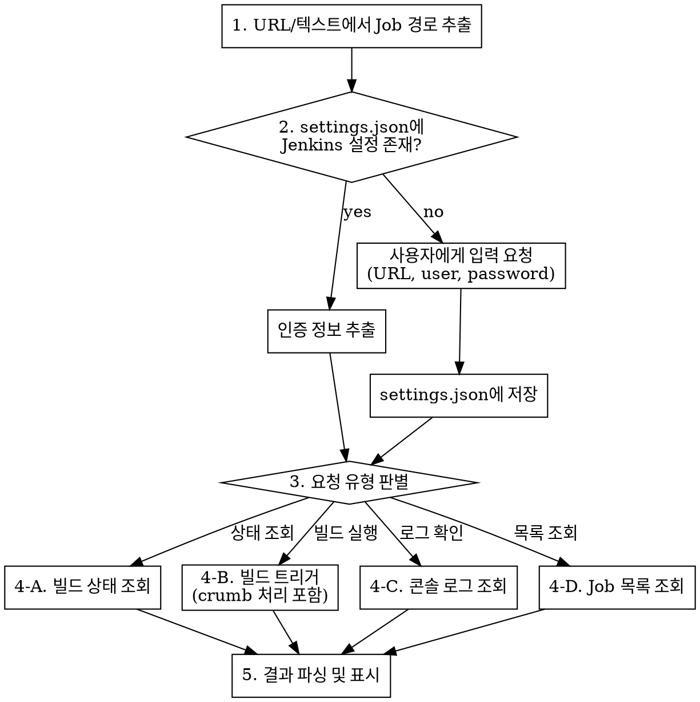

# Fetch Jenkins

## Overview

Jenkins REST API를 curl로 직접 호출하여 빌드 상태 조회, 빌드 트리거, 콘솔 로그 조회를 수행하는 skill. 내부망 Jenkins 전용이므로 MCP 없이 REST API만 사용한다.

## 허용된 Jenkins 서버 (절대 규칙)

**이 스킬은 아래 등록된 서버에만 연동할 수 있다. 다른 Jenkins 서버에는 절대 연동하지 않는다.**

- `https://test-jenkins-v2.desimone.co.kr`

사용자가 다른 Jenkins URL을 요청하더라도 거부하고, 위 서버만 사용 가능하다고 안내한다. 새로운 서버를 추가하려면 이 SKILL.md 파일의 허용 목록을 직접 수정해야 한다.

## When to Use

- 사용자가 Jenkins URL을 공유할 때 (`*/job/*`)
- 사용자가 Jenkins Job 이름을 언급할 때
- "빌드 상태 확인", "빌드 돌려줘", "젠킨스", "배포" 등 요청 시
- Jenkins 콘솔 로그 확인 요청 시

## 조회 흐름



## Step 1: Job 경로 파싱

### URL에서 추출

URL 패턴: `https://{domain}/job/{segment1}/job/{segment2}/...`

```
https://test-jenkins-v2.desimone.co.kr/job/MyFolder/job/my-app/42/
→ Job path: /job/MyFolder/job/my-app
→ Build number: 42
```

### 이름에서 변환

사용자가 Job 이름만 언급한 경우, `/` 구분자를 `/job/`으로 변환:

| 사용자 입력 | API Path |
|------------|----------|
| `my-app` | `/job/my-app` |
| `MyFolder/my-app` | `/job/MyFolder/job/my-app` |
| `a/b/c` | `/job/a/job/b/job/c` |

## Step 2: 설정 확인 및 서버 선택

`~/.claude/settings.json`에서 `jenkins` 필드를 확인한다. Jenkins 서버는 **별칭(alias) 기반**으로 여러 개 등록할 수 있다.

### 설정 구조

```json
{
  "jenkins": {
    "배포 테스트 젠킨스": {
      "baseUrl": "https://test-jenkins-v2.desimone.co.kr",
      "user": "syb1224",
      "password": "syb1224"
    }
  }
}
```

### 서버 선택 로직

**허용된 서버는 `https://test-jenkins-v2.desimone.co.kr` 하나뿐이다.** 다른 Jenkins URL 요청은 거부한다.

1. 사용자 메시지에서 **별칭 키워드 매칭**: "젠킨스", "테스트 젠킨스", "배포 테스트 젠킨스" 등 → `배포 테스트 젠킨스` 서버 자동 선택
2. 사용자가 **허용된 Jenkins URL을 공유**한 경우: 동일 서버이므로 그대로 사용
3. 사용자가 **허용되지 않은 Jenkins URL을 요청**한 경우: "현재 연동 가능한 Jenkins 서버는 `https://test-jenkins-v2.desimone.co.kr`만 허용되어 있습니다." 라고 안내하고 요청을 거부한다

### 설정이 없는 경우

settings.json에 jenkins 설정이 없으면 AskUserQuestion으로 **인증 정보만** 요청한다 (서버 URL은 고정):

| 항목 | 설명 | 예시 |
|------|------|------|
| user | Jenkins 사용자 ID | `syb1224` |
| password | Jenkins 비밀번호 | `****` |

baseUrl은 항상 `https://test-jenkins-v2.desimone.co.kr`로 고정한다.

**주의**: 기존 settings.json을 Read로 먼저 읽고, 기존 설정을 보존하면서 jenkins 설정만 추가/수정한다 (Read → Edit 패턴).

### 인증 정보 추출

settings.json을 Read 도구로 읽어서 선택된 서버의 `baseUrl`, `user`, `password` 값을 추출한다. 이후 curl 명령에서 사용:

```bash
# Read 도구로 settings.json을 읽은 후 값을 직접 사용
curl -s -u "USER:PASSWORD" "BASE_URL/..."
```

## Step 3: API 호출

모든 호출은 Basic Auth (`-u "user:password"`)를 사용한다.

**필수 curl 옵션**: 모든 curl 명령에 반드시 다음 옵션을 포함한다:
- `-k`: SSL 인증서 검증 무시 (내부망 자체 서명 인증서 대응)
- `--globoff`: URL의 `[]` 문자를 glob 패턴으로 해석하지 않도록 함 (Jenkins tree 파라미터에 필수)

### 3-A. 빌드 상태 조회

**특정 Job의 최근 빌드:**
```bash
curl -k -s --globoff -u "$USER:$PASS" \
  "$BASE_URL{job-path}/lastBuild/api/json?tree=number,result,timestamp,duration,displayName,building"
```

**특정 빌드 번호:**
```bash
curl -k -s --globoff -u "$USER:$PASS" \
  "$BASE_URL{job-path}/{build-number}/api/json?tree=number,result,timestamp,duration,displayName,building"
```

**Job 정보 (최근 빌드 포함):**
```bash
curl -k -s --globoff -u "$USER:$PASS" \
  "$BASE_URL{job-path}/api/json?tree=name,url,color,lastBuild[number,result,timestamp,duration],builds[number,result,timestamp]{0,5}"
```

### 3-B. 빌드 트리거

**중요**: POST 요청은 CSRF 보호를 위해 crumb 토큰이 필요하다.

**Step 1 - Crumb 조회:**
```bash
CRUMB_JSON=$(curl -k -s --globoff -u "$USER:$PASS" "$BASE_URL/crumbIssuer/api/json")
# JSON에서 crumbRequestField와 crumb 값 추출
# 예: {"_class":"...","crumb":"abc123","crumbRequestField":"Jenkins-Crumb"}
```

python3으로 파싱:
```bash
CRUMB_HEADER=$(echo "$CRUMB_JSON" | python3 -c "import sys,json; d=json.load(sys.stdin); print(d['crumbRequestField']+':'+d['crumb'])")
```

**Step 2 - 빌드 실행:**

파라미터 없는 빌드:
```bash
curl -k -s --globoff -X POST -u "$USER:$PASS" \
  -H "$CRUMB_HEADER" \
  "$BASE_URL{job-path}/build"
```

파라미터 빌드:
```bash
curl -k -s --globoff -X POST -u "$USER:$PASS" \
  -H "$CRUMB_HEADER" \
  "$BASE_URL{job-path}/buildWithParameters?param1=value1&param2=value2"
```

**빌드 트리거 전 확인**: 빌드를 트리거하기 전에 반드시 사용자에게 확인을 받는다. Job 이름과 파라미터를 보여주고 실행 여부를 묻는다.

**파라미터 확인**: Job에 어떤 파라미터가 있는지 모를 때:
```bash
curl -k -s --globoff -u "$USER:$PASS" \
  "$BASE_URL{job-path}/api/json?tree=property[parameterDefinitions[name,type,defaultParameterValue[value],description]]"
```

### 3-C. 콘솔 로그 조회

```bash
curl -k -s --globoff -u "$USER:$PASS" \
  "$BASE_URL{job-path}/{build-number}/consoleText"
```

로그가 길 수 있으므로 마지막 100줄만 표시하고, 전체 로그가 필요한지 사용자에게 확인한다.

### 3-D. Job 목록 조회

**전체 Job 목록:**
```bash
curl -k -s --globoff -u "$USER:$PASS" \
  "$BASE_URL/api/json?tree=jobs[name,color,url]"
```

**Folder 내 Job 목록:**
```bash
curl -k -s --globoff -u "$USER:$PASS" \
  "$BASE_URL/job/{folder}/api/json?tree=jobs[name,color,url]"
```

## Step 4: 결과 포맷팅

### 빌드 상태

```markdown
## {Job 이름} - Build #{number}

| 항목 | 값 |
|------|-----|
| 상태 | SUCCESS / FAILURE / UNSTABLE / BUILDING |
| 빌드 번호 | #123 |
| 소요 시간 | 2m 30s |
| 시작 시각 | 2026-03-27 14:30:00 |
| URL | https://test-jenkins-v2.desimone.co.kr/job/.../123/ |
```

`color` 필드 매핑:
- `blue` → SUCCESS
- `red` → FAILURE
- `yellow` → UNSTABLE
- `blue_anime` / `red_anime` / `yellow_anime` → 빌드 중 (이전 상태 + BUILDING)
- `disabled` → 비활성화
- `notbuilt` → 빌드 없음

`timestamp`는 Unix milliseconds → `python3 -c "import datetime; print(datetime.datetime.fromtimestamp(TIMESTAMP/1000).strftime('%Y-%m-%d %H:%M:%S'))"` 로 변환.

`duration`은 milliseconds → 분/초로 변환.

### 빌드 트리거 결과

```markdown
빌드가 큐에 등록되었습니다.

| 항목 | 값 |
|------|-----|
| Job | {job-name} |
| Queue URL | {Location 헤더 값} |

빌드 상태를 확인하려면 잠시 후 상태 조회를 요청하세요.
```

### Job 목록

```markdown
## Jenkins Jobs

| Job | 상태 |
|-----|------|
| my-app | SUCCESS |
| my-api | FAILURE |
| my-batch | BUILDING |
```

## 에러 처리

| HTTP 상태 | 의미 | 대응 |
|-----------|------|------|
| 401 | 인증 실패 | "Jenkins 인증 정보를 확인해주세요. settings.json의 jenkins.user와 jenkins.password가 올바른지 확인하세요." |
| 403 | 권한 없음 / CSRF | crumb 관련 이슈인지 확인. crumb 재발급 시도. 그래도 실패 시 "해당 Job에 대한 권한이 없습니다." |
| 404 | Job/빌드 없음 | "Job 이름 또는 경로를 확인해주세요. Folder 구조인 경우 `folder/job-name` 형식으로 입력하세요." |
| 네트워크 오류 | 접근 불가 | "Jenkins 서버에 접근할 수 없습니다. 내부망 연결 상태를 확인해주세요." |

## Common Mistakes

- **curl에 `-k --globoff` 필수**: `-k` 없으면 SSL 에러, `--globoff` 없으면 `tree=jobs[name]` 같은 URL에서 exit code 3 발생
- settings.json 수정 시 기존 설정을 덮어쓰지 않도록 주의 (Read 후 Edit)
- Job path 변환 시 `/` → `/job/` 변환 잊지 않기
- POST 요청 시 crumb 토큰 필수 (빠뜨리면 403 에러)
- 콘솔 로그는 매우 길 수 있으므로 tail 처리 필요
- `building: true`인 경우 result가 null일 수 있음 — "빌드 진행 중"으로 표시
- password에 특수문자가 있으면 curl에서 따옴표로 감싸기
