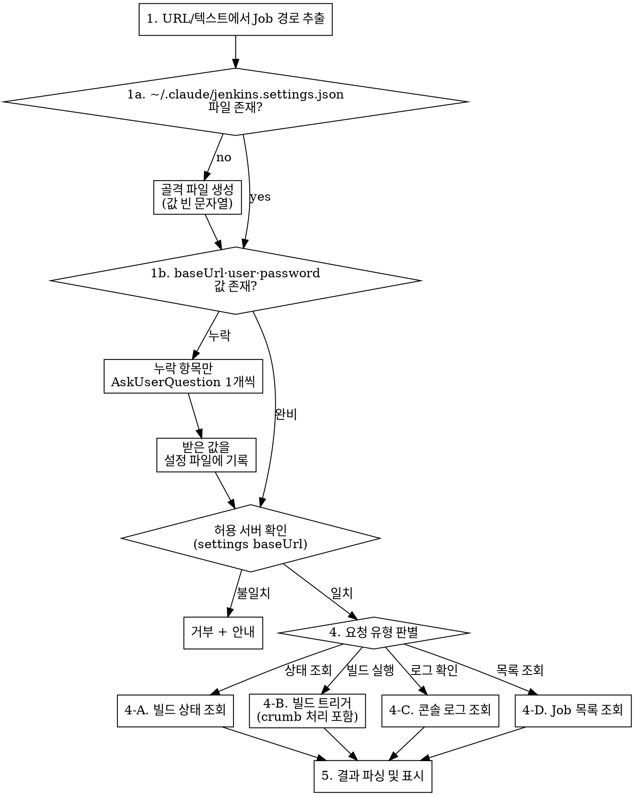

# Fetch Jenkins

## Overview

Jenkins REST API를 curl로 직접 호출하여 빌드 상태 조회, 빌드 트리거, 콘솔 로그 조회를 수행하는 skill. 내부망 Jenkins 전용이므로 MCP 없이 REST API만 사용한다.

접속 대상 Jenkins 서버(`baseUrl`)·자격증명은 **코드에 박지 않고** 글로벌 설정 파일 `~/.claude/jenkins.settings.json`에서 읽는다. 이 파일은 사내 서버 주소와 자격증명을 담으므로 **플러그인 저장소(공개)에는 절대 커밋하지 않는다.**

## 허용된 Jenkins 서버 (절대 규칙)

**이 스킬은 `~/.claude/jenkins.settings.json`의 `baseUrl`에 등록된 서버에만 연동한다. 다른 Jenkins 서버에는 절대 연동하지 않는다.**

- 사용자가 settings의 `baseUrl`과 다른 Jenkins URL을 요청하면 "등록된 Jenkins 서버만 연동 가능합니다"라고 안내하고 거부한다. 거부 메시지에 실제 도메인을 노출하지 않는다.
- 새로운 서버를 등록하려면 `~/.claude/jenkins.settings.json`의 `baseUrl`을 직접 수정한다.

## When to Use

- 사용자가 Jenkins URL을 공유할 때 (`*/job/*`)
- 사용자가 Jenkins Job 이름을 언급할 때
- "빌드 상태 확인", "빌드 돌려줘", "젠킨스", "배포" 등 요청 시
- Jenkins 콘솔 로그 확인 요청 시

## 조회 흐름



## Step 1: 설정 로드

### 1a. 파일 존재 확인

`~/.claude/jenkins.settings.json` 파일이 없으면 아래 골격으로 생성한다:

```json
{
  "baseUrl": "",
  "user": "",
  "password": ""
}
```

> **민감정보 경고**: 이 파일은 자격증명을 포함한다. `~/.claude/`에만 두고 저장소에 커밋하지 않는다.

### 1b. 누락 필드 질문

파일을 읽어 빈 문자열(`""`) 필드를 확인한다. 누락 필드가 있으면 **하나씩** AskUserQuestion으로 질문하고 받은 값을 설정 파일에 기록한다. 질문 순서: `baseUrl` → `user` → `password`.

| 항목 | 설명 | 예시 |
|------|------|------|
| baseUrl | Jenkins 서버 URL (프로토콜 포함, 끝 `/` 없이) | `https://your-jenkins.example.com` |
| user | Jenkins 사용자 ID | `<user>` |
| password | Jenkins 비밀번호 | `<password>` |

인증은 현행 Basic auth `user:password` 유지(향후 apiToken 마이그레이션 가능).

파일 수정 시 Read → Edit 패턴으로 기존 값을 보존하며 갱신한다.

## Step 2: 허용 서버 확인 (설정 로드 완료 후 별도 가드 단계)

설정 로드(Step 1)가 완료된 뒤 **독립적으로** 실행하는 보안 게이트. flowchart의 `guard` 노드에 대응한다.

- 사용자가 URL을 공유한 경우: 해당 URL의 호스트가 settings `baseUrl` 호스트와 **일치하면 진행, 불일치하면 거부**.
- Job 이름만 언급한 경우: settings `baseUrl`을 그대로 사용하므로 항상 통과.
- 거부 시: "등록된 Jenkins 서버만 연동 가능합니다"로 안내. 실제 도메인 노출 금지.

## Step 3: Job 경로 파싱

### URL에서 추출

URL 패턴: `https://{domain}/job/{segment1}/job/{segment2}/...`

```
https://your-jenkins.example.com/job/MyFolder/job/my-app/42/
→ Job path: /job/MyFolder/job/my-app
→ Build number: 42
```

### 이름에서 변환

사용자가 Job 이름만 언급한 경우, `/` 구분자를 `/job/`으로 변환:

| 사용자 입력 | API Path |
|------------|----------|
| `my-app` | `/job/my-app` |
| `MyFolder/my-app` | `/job/MyFolder/job/my-app` |
| `a/b/c` | `/job/a/job/b/job/c` |

## Step 4: API 호출

모든 호출은 Basic Auth (`-u "user:password"`)를 사용한다.

**필수 curl 옵션**: 모든 curl 명령에 반드시 다음 옵션을 포함한다:
- `-k`: SSL 인증서 검증 무시 (내부망 자체 서명 인증서 대응)
- `--globoff`: URL의 `[]` 문자를 glob 패턴으로 해석하지 않도록 함 (Jenkins tree 파라미터에 필수)

### 4-A. 빌드 상태 조회

**특정 Job의 최근 빌드:**
```bash
curl -k -s --globoff -u "$USER:$PASS" \
  "$BASE_URL{job-path}/lastBuild/api/json?tree=number,result,timestamp,duration,displayName,building"
```

**특정 빌드 번호:**
```bash
curl -k -s --globoff -u "$USER:$PASS" \
  "$BASE_URL{job-path}/{build-number}/api/json?tree=number,result,timestamp,duration,displayName,building"
```

**Job 정보 (최근 빌드 포함):**
```bash
curl -k -s --globoff -u "$USER:$PASS" \
  "$BASE_URL{job-path}/api/json?tree=name,url,color,lastBuild[number,result,timestamp,duration],builds[number,result,timestamp]{0,5}"
```

### 4-B. 빌드 트리거

**중요**: POST 요청은 CSRF 보호를 위해 crumb 토큰이 필요하다.

**Step 1 - Crumb 조회:**
```bash
CRUMB_JSON=$(curl -k -s --globoff -u "$USER:$PASS" "$BASE_URL/crumbIssuer/api/json")
# JSON에서 crumbRequestField와 crumb 값 추출
# 예: {"_class":"...","crumb":"abc123","crumbRequestField":"Jenkins-Crumb"}
```

python3으로 파싱:
```bash
CRUMB_HEADER=$(echo "$CRUMB_JSON" | python3 -c "import sys,json; d=json.load(sys.stdin); print(d['crumbRequestField']+':'+d['crumb'])")
```

**Step 2 - 빌드 실행:**

파라미터 없는 빌드:
```bash
curl -k -s --globoff -X POST -u "$USER:$PASS" \
  -H "$CRUMB_HEADER" \
  "$BASE_URL{job-path}/build"
```

파라미터 빌드:
```bash
curl -k -s --globoff -X POST -u "$USER:$PASS" \
  -H "$CRUMB_HEADER" \
  "$BASE_URL{job-path}/buildWithParameters?param1=value1&param2=value2"
```

**빌드 트리거 전 확인**: 빌드를 트리거하기 전에 반드시 사용자에게 확인을 받는다. Job 이름과 파라미터를 보여주고 실행 여부를 묻는다.

**파라미터 확인**: Job에 어떤 파라미터가 있는지 모를 때:
```bash
curl -k -s --globoff -u "$USER:$PASS" \
  "$BASE_URL{job-path}/api/json?tree=property[parameterDefinitions[name,type,defaultParameterValue[value],description]]"
```

### 4-C. 콘솔 로그 조회

```bash
curl -k -s --globoff -u "$USER:$PASS" \
  "$BASE_URL{job-path}/{build-number}/consoleText"
```

로그가 길 수 있으므로 마지막 100줄만 표시하고, 전체 로그가 필요한지 사용자에게 확인한다.

### 4-D. Job 목록 조회

**전체 Job 목록:**
```bash
curl -k -s --globoff -u "$USER:$PASS" \
  "$BASE_URL/api/json?tree=jobs[name,color,url]"
```

**Folder 내 Job 목록:**
```bash
curl -k -s --globoff -u "$USER:$PASS" \
  "$BASE_URL/job/{folder}/api/json?tree=jobs[name,color,url]"
```

## Step 5: 결과 포맷팅

### 빌드 상태

```markdown
## {Job 이름} - Build #{number}

| 항목 | 값 |
|------|-----|
| 상태 | SUCCESS / FAILURE / UNSTABLE / BUILDING |
| 빌드 번호 | #123 |
| 소요 시간 | 2m 30s |
| 시작 시각 | 2026-03-27 14:30:00 |
| URL | {baseUrl}/job/.../123/ |
```

`color` 필드 매핑:
- `blue` → SUCCESS
- `red` → FAILURE
- `yellow` → UNSTABLE
- `blue_anime` / `red_anime` / `yellow_anime` → 빌드 중 (이전 상태 + BUILDING)
- `disabled` → 비활성화
- `notbuilt` → 빌드 없음

`timestamp`는 Unix milliseconds → `python3 -c "import datetime; print(datetime.datetime.fromtimestamp(TIMESTAMP/1000).strftime('%Y-%m-%d %H:%M:%S'))"` 로 변환.

`duration`은 milliseconds → 분/초로 변환.

### 빌드 트리거 결과

```markdown
빌드가 큐에 등록되었습니다.

| 항목 | 값 |
|------|-----|
| Job | {job-name} |
| Queue URL | {Location 헤더 값} |

빌드 상태를 확인하려면 잠시 후 상태 조회를 요청하세요.
```

### Job 목록

```markdown
## Jenkins Jobs

| Job | 상태 |
|-----|------|
| my-app | SUCCESS |
| my-api | FAILURE |
| my-batch | BUILDING |
```

## 에러 처리

| HTTP 상태 | 의미 | 대응 |
|-----------|------|------|
| 401 | 인증 실패 | "Jenkins 인증 정보를 확인해주세요. ~/.claude/jenkins.settings.json의 user와 password가 올바른지 확인하세요." |
| 403 | 권한 없음 / CSRF | crumb 관련 이슈인지 확인. crumb 재발급 시도. 그래도 실패 시 "해당 Job에 대한 권한이 없습니다." |
| 404 | Job/빌드 없음 | "Job 이름 또는 경로를 확인해주세요. Folder 구조인 경우 `folder/job-name` 형식으로 입력하세요." |
| 네트워크 오류 | 접근 불가 | "Jenkins 서버에 접근할 수 없습니다. 내부망 연결 상태를 확인해주세요." |

## Common Mistakes

- **curl에 `-k --globoff` 필수**: `-k` 없으면 SSL 에러, `--globoff` 없으면 `tree=jobs[name]` 같은 URL에서 exit code 3 발생
- 설정 파일 수정 시 기존 값을 덮어쓰지 않도록 주의 (Read 후 Edit)
- Job path 변환 시 `/` → `/job/` 변환 잊지 않기
- POST 요청 시 crumb 토큰 필수 (빠뜨리면 403 에러)
- 콘솔 로그는 매우 길 수 있으므로 tail 처리 필요
- `building: true`인 경우 result가 null일 수 있음 — "빌드 진행 중"으로 표시
- password에 특수문자가 있으면 curl에서 따옴표로 감싸기
