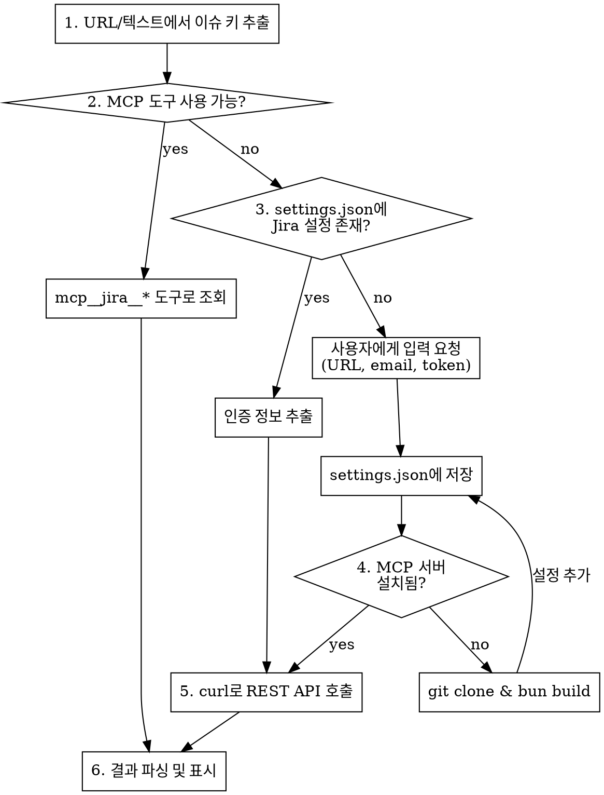

# Fetch Jira Issue

## Overview

Jira URL이나 이슈 키로부터 이슈 정보를 조회하는 skill. MCP 도구를 우선 시도하고, 불가능하면 REST API로 fallback한다.

## When to Use

- 사용자가 Jira URL을 공유할 때 (`*/browse/ISSUE-KEY`)
- 사용자가 Jira 이슈 키를 언급할 때 (예: `PROJECT-123`)
- "Jira 이슈 확인해줘", "티켓 내용 알려줘" 등 요청 시

## 이슈 키 추출

URL 패턴: `https://{domain}/browse/{ISSUE-KEY}`

```
https://hh.hectoqnm.kr/browse/PROJECT-123
→ ISSUE-KEY: PROJECT-123
```

이슈 키만 언급된 경우 (예: `PROJECT-123`), 설정의 `JIRA_BASE_URL`을 사용하여 전체 URL을 구성한다.

## 조회 흐름



## Step 1: MCP 도구 시도

MCP 도구(`mcp__jira__*`)가 세션에 로드되어 있으면 바로 사용한다.

```
mcp__jira__get_issue → 이슈 키로 조회
```

MCP 도구가 없으면 Step 2로 진행.

## Step 2: 설정 확인 (Fallback)

`~/.claude/settings.json`에서 `mcpServers.jira.env` 확인:

```json
{
  "mcpServers": {
    "jira": {
      "command": "node",
      "args": ["~/.claude/mcp-servers/jira-mcp/build/index.js"],
      "env": {
        "JIRA_API_TOKEN": "<token>",
        "JIRA_BASE_URL": "<base-url>",
        "JIRA_USER_EMAIL": "<email>",
        "JIRA_TYPE": "server",
        "JIRA_AUTH_TYPE": "basic"
      }
    }
  }
}
```

### 설정이 없는 경우

사용자에게 다음 정보를 AskUserQuestion으로 요청:

| 항목 | 설명 | 예시 |
|------|------|------|
| JIRA_BASE_URL | Jira 서버 URL | `https://hh.hectoqnm.kr` |
| JIRA_USER_EMAIL | 사용자 ID 또는 이메일 | `your-id` |
| JIRA_API_TOKEN | API 토큰 또는 비밀번호 | `****` |
| JIRA_TYPE | cloud 또는 server | `server` |
| JIRA_AUTH_TYPE | basic 또는 bearer | `basic` |

입력받은 정보를 `~/.claude/settings.json`의 `mcpServers.jira`에 저장한다.

**주의**: 기존 settings.json 내용을 Read로 먼저 읽고, 기존 설정을 보존하면서 jira 설정만 추가/수정한다.

## Step 3: MCP 서버 설치 확인

`~/.claude/mcp-servers/jira-mcp/build/index.js` 존재 여부 확인.

### 설치되지 않은 경우

```bash
# bun 확인
which bun || (echo "bun이 필요합니다" && curl -fsSL https://bun.sh/install | bash)

# Jira MCP 서버 클론 및 빌드
mkdir -p ~/.claude/mcp-servers
cd ~/.claude/mcp-servers
git clone https://github.com/cosmix/jira-mcp.git
cd jira-mcp
bun install
bun run build
```

설치 후 settings.json에 mcpServers.jira 설정을 추가한다.

**설치 후 안내**: "MCP 서버가 설치되었습니다. 다음 세션부터 `mcp__jira__*` 도구를 직접 사용할 수 있습니다. 현재 세션에서는 REST API로 조회합니다."

## Step 4: REST API 호출

설정에서 인증 정보를 추출하여 curl로 호출:

```bash
# settings.json에서 인증 정보 읽기
JIRA_BASE_URL=$(cat ~/.claude/settings.json | python3 -c "import sys,json; print(json.load(sys.stdin)['mcpServers']['jira']['env']['JIRA_BASE_URL'])")
JIRA_USER=$(cat ~/.claude/settings.json | python3 -c "import sys,json; print(json.load(sys.stdin)['mcpServers']['jira']['env']['JIRA_USER_EMAIL'])")
JIRA_TOKEN=$(cat ~/.claude/settings.json | python3 -c "import sys,json; print(json.load(sys.stdin)['mcpServers']['jira']['env']['JIRA_API_TOKEN'])")

# 이슈 조회
curl -s -u "$JIRA_USER:$JIRA_TOKEN" \
  "$JIRA_BASE_URL/rest/api/2/issue/ISSUE-KEY?fields=summary,description,status,assignee,priority,issuetype,comment"
```

## Step 5: 결과 표시

JSON 응답에서 다음 정보를 추출하여 마크다운으로 정리:

```markdown
## [ISSUE-KEY] 이슈 제목

| 항목 | 값 |
|------|-----|
| 유형 | Bug / Task / Story 등 |
| 상태 | Open / In Progress / Done 등 |
| 우선순위 | High / Medium / Low 등 |
| 담당자 | 담당자명 |

### 설명
(description 필드 내용, Jira 마크업을 마크다운으로 변환)

### 댓글 (N개)
**작성자** - 2025-01-01 10:00
> 댓글 내용

**작성자2** - 2025-01-02 11:00
> 댓글 내용
```

## 다른 에이전트에서 사용

이 skill의 로직은 Claude Code 외 다른 AI 에이전트에서도 동일하게 적용 가능:

| 에이전트 | 설정 파일 위치 |
|----------|---------------|
| Claude Code | `~/.claude/settings.json` |
| 기타 에이전트 | 해당 에이전트의 MCP 설정 파일 |

핵심은 동일: Jira 인증 정보(URL, 사용자, 토큰)를 확보한 뒤 REST API로 호출.

## Common Mistakes

- settings.json 수정 시 기존 설정을 덮어쓰지 않도록 주의 (Read 후 Edit)
- `JIRA_TYPE`이 `server`인 경우 API 경로가 `/rest/api/2/`임 (cloud는 `/rest/api/3/`)
- 이슈 키는 대소문자를 구분하므로 원본 그대로 사용
- curl 호출 시 특수문자가 포함된 토큰은 반드시 따옴표로 감싸기
