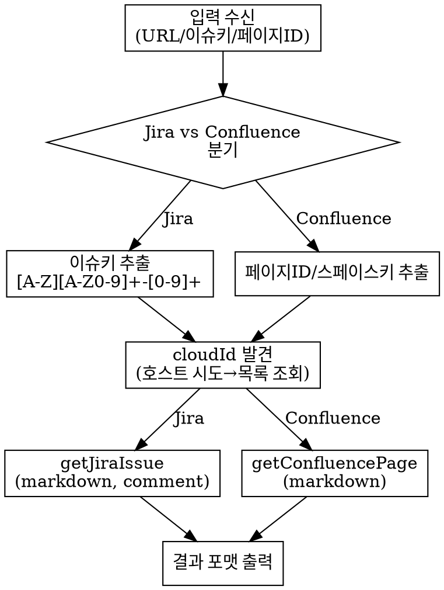

# Fetch Jira Issue

## Overview

Jira URL/이슈키 또는 Confluence URL/페이지ID로부터 이슈·페이지 정보를 조회하는 내부 유틸 스킬. 공식 Atlassian MCP(`mcp__claude_ai_Atlassian__*`)만 사용한다. MCP 미연결 시 안내 후 중단.

## 의존 도구

`mcp__claude_ai_Atlassian__*` 도구들이 세션에 로드되어 있어야 한다. 로드되지 않은 경우 → "MCP 미연결 시" 섹션 참조.

주요 도구:
- `getAccessibleAtlassianResources` — 접근 가능한 Atlassian 사이트 목록 조회 (cloudId 발견)
- `getJiraIssue` — Jira 이슈 조회
- `searchJiraIssuesUsingJql` — JQL 기반 이슈 검색 (보조)
- `getConfluencePage` — Confluence 페이지 조회
- `getConfluenceSpaces` — Confluence 스페이스 목록 (key → spaceId 해석)
- `getPagesInConfluenceSpace` — 스페이스 내 페이지 목록
- `searchConfluenceUsingCql` — CQL 기반 Confluence 검색

## When to Use

- 사용자가 Jira URL을 공유할 때 (`*/browse/ISSUE-KEY`)
- 사용자가 Jira 이슈 키를 언급할 때 (예: `PROJ-123`, `AB-45`)
- "Jira 이슈 확인해줘", "티켓 내용 알려줘" 등 요청 시
- 사용자가 Confluence URL을 공유할 때 (`*/wiki/x/{id}` 또는 `*/wiki/spaces/...`)
- "Confluence 페이지 내용 알려줘", "위키 페이지 조회해줘" 등 요청 시

## 입력 식별 — Jira vs Confluence 분기

입력에서 아래 순서로 판별한다:

1. URL에 `/wiki/` 포함 → **Confluence 페이지 조회** 섹션으로
2. URL에 `/browse/` 포함 또는 이슈키 패턴(`[A-Z][A-Z0-9]+-[0-9]+`) 감지 → **Jira 이슈 조회** 섹션으로
3. 어디에도 해당하지 않으면 → AskUserQuestion으로 "Jira 이슈인지 Confluence 페이지인지" 확인

## 이슈키·URL 추출

### Jira URL 패턴 (임의 호스트 포괄)

```
URL:      https?://[^/\s]+/browse/([A-Z][A-Z0-9]+-[0-9]+)
이슈키:   [A-Z][A-Z0-9]+-[0-9]+
```

예시 (플레이스홀더):
```
https://your-site.atlassian.net/browse/PROJ-123
→ 이슈키: PROJ-123
```

이슈키 단독 입력(예: `PROJ-123`, `AB-45`) → 그대로 `issueIdOrKey`로 사용. URL 구성 불필요.

### Confluence URL 패턴

```
tiny-link:  https?://[^/\s]+/wiki/x/([A-Za-z0-9]+)
긴 형식:    https?://[^/\s]+/wiki/spaces/[^/]+/pages/(\d+)
```

## cloudId 발견 (공통 — Jira·Confluence 재사용)

아래 절차를 Jira·Confluence 조회 시 공통으로 사용한다.

1. 입력 URL에 호스트네임이 있으면 해당 호스트네임을 `cloudId`로 먼저 시도 (`getJiraIssue`/`getConfluencePage`의 `cloudId` 파라미터에 호스트네임을 그대로 전달).
2. 실패하거나 이슈키 단독 입력이면 `getAccessibleAtlassianResources()`로 사이트 목록 조회:
   - 사이트 1개 → 해당 `cloudId` 자동 선택
   - 사이트 여러 개 + 입력 URL에 호스트네임 있음 → 반환된 각 사이트의 `url`과 런타임 대조 → 매칭되는 사이트 선택
   - 매칭 안 됨 → AskUserQuestion (사이트 목록 제시, 자동 선택 없음)

저장소에 도메인이나 cloudId를 하드코딩하지 않는다.

## 조회 흐름



## Jira 이슈 조회

```
getJiraIssue(
  cloudId: <발견된 cloudId>,
  issueIdOrKey: <추출된 이슈키>,
  fields: [summary, description, status, assignee, priority, issuetype, comment],
  responseContentFormat: "markdown"
)
```

`responseContentFormat="markdown"` 지정 시 MCP가 마크다운으로 반환하므로 수동 변환 불필요.

## Jira 검색 (보조)

이슈키 없이 조건으로 검색할 때 사용한다.

```
searchJiraIssuesUsingJql(
  cloudId: <cloudId>,
  jql: "assignee = currentUser() AND resolution = Unresolved",
  fields: [summary, status, priority, assignee],
  maxResults: 50
)
```

JQL 예시:
- 내게 할당된 미해결: `assignee = currentUser() AND resolution = Unresolved`
- 프로젝트 진행 중: `project = PROJ AND status = "In Progress"`

## Confluence 페이지 조회

cloudId는 위 "cloudId 발견" 공통 절차를 재사용한다.

### 입력 유형별 도구 매핑

| 입력 | 도구 | 처리 |
|------|------|------|
| tiny-link `/wiki/x/{id}` | `getConfluencePage` | `pageId=id` 그대로 전달 (디코딩 불필요) |
| 긴 형식 `/wiki/spaces/{KEY}/pages/{숫자id}/...` | `getConfluencePage` | 정규식 `/pages/(\d+)` → pageId 추출 |
| 페이지 ID 단독 (숫자) | `getConfluencePage` | 그대로 사용 |
| 스페이스 키 (예: `DEV`) | `getConfluenceSpaces(keys=[KEY])` → spaceId → `getPagesInConfluenceSpace(spaceId)` | 2-step 필수 |
| 검색어 | `searchConfluenceUsingCql(cql='title ~ "..." AND type = page')` | — |

```
getConfluencePage(
  cloudId: <cloudId>,
  pageId: <추출된 pageId>,
  contentFormat: "markdown"
)
```

스페이스 페이지 목록:
```
# Step 1: 스페이스 key → spaceId 해석
getConfluenceSpaces(cloudId, keys=["KEY"])
# → 반환된 spaceId (숫자)

# Step 2: 페이지 목록
getPagesInConfluenceSpace(cloudId, spaceId=<숫자 spaceId>)
```

CQL 검색:
```
searchConfluenceUsingCql(cloudId, cql='space = "KEY" AND title ~ "검색어" AND type = page')
```

**주의**: `getPagesInConfluenceSpace`의 `spaceId`는 숫자(내부 ID)이고, `searchConfluenceUsingCql`의 `cql`의 `space` 필드는 space key(문자열)다. 비대칭이므로 반드시 `getConfluenceSpaces`로 key→spaceId를 해석한 뒤 `getPagesInConfluenceSpace`를 호출한다.

## 결과 표시 포맷

### Jira 이슈

```markdown
## [PROJ-123] 이슈 제목

| 항목 | 값 |
|------|-----|
| 유형 | Bug / Task / Story 등 |
| 상태 | Open / In Progress / Done 등 |
| 우선순위 | High / Medium / Low 등 |
| 담당자 | 담당자명 |

### 설명
(MCP가 반환한 markdown 내용 그대로)

### 댓글 (N개)
**작성자** - 2025-01-01 10:00
> 댓글 내용
```

### Confluence 페이지

```markdown
## [Confluence] 페이지 제목

| 항목 | 값 |
|------|-----|
| 스페이스 | 스페이스명 (KEY) |
| 페이지 ID | 123456 |
| 최종 수정 | 2025-01-01 |

### 본문
(MCP가 반환한 markdown 내용 그대로)
```

## MCP 미연결 시

`mcp__claude_ai_Atlassian__*` 도구가 세션에 없으면:

> Atlassian MCP 연결이 필요합니다. Claude Code의 MCP 설정에서 Atlassian 커넥터를 연결한 뒤 다시 시도하세요.

대체 경로 없음. 안내 출력 후 즉시 중단.

기존 `~/.claude/settings.json`의 `mcpServers.jira` 설정이 남아 있어도 이 스킬과 무관하다(무해). 더 이상 사용하지 않으므로 수동으로 정리해도 된다.

## 다른 에이전트에서 사용

호출 시그니처:
```
Skill("oh-my-beom:fetch-jira-issue", args="<URL 또는 이슈키>")
```

결과는 `.dev/jira-context.md`에 저장하는 규약을 따른다(호출 스킬의 지시에 따름).

## Common Mistakes

- `getPagesInConfluenceSpace`는 숫자 spaceId가 필요하다. space key(`DEV`, `TEAM`)를 직접 전달하면 동작하지 않는다. 반드시 `getConfluenceSpaces(keys=[...])` 2-step을 먼저 수행해 spaceId를 해석하라.
- `searchConfluenceUsingCql`의 CQL `space` 필드는 반대로 space key(문자열)다. 숫자 spaceId를 CQL에 넣으면 결과가 없을 수 있다.
- URL과 이슈키가 함께 있으면 URL 파싱 결과를 신뢰한다. 이슈키 단독 정규식 오탐(예: `COVID-19`, ISO-8601 날짜) 방지에 유효.
- 이슈키 단독 입력이 MCP 404를 반환하면 오탐일 수 있음 — 결과를 사용자에게 안내하고 중단.
- cloudId는 저장소에 하드코딩하지 않는다. 항상 런타임 발견.
